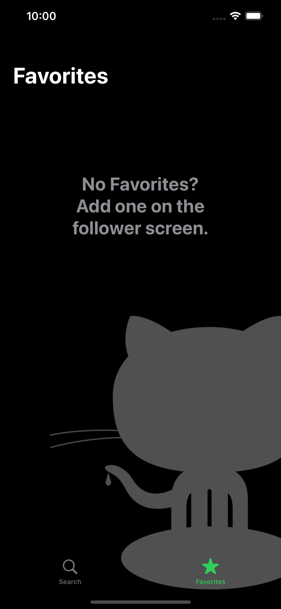
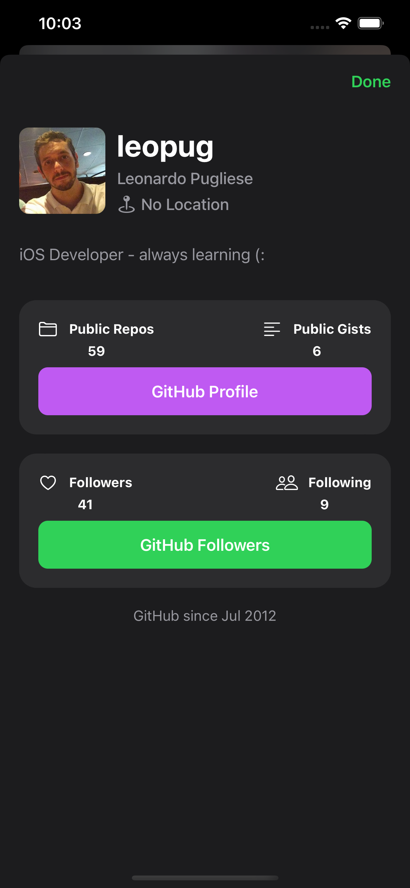

# Github Followers

## Topics
Programmatically UI Building , Network calls , JSON Parsing and Displaying , Codable , Loading States , Memory Management , Image Caching , Pagination , Custom Alerts, Search Animation , Diffable Data Source , Collection Views, Child View Controller , Persistence , UITableView , Dynamic Type , SFSymbols , UIStackView , DateFormatter , Delegation

## Screenshots
 

